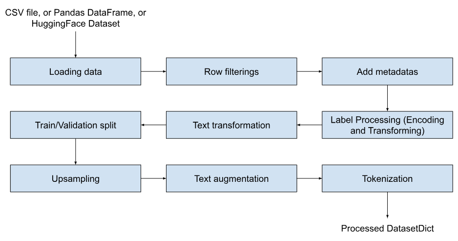

# Welcome to that-nlp-library

<!-- WARNING: THIS FILE WAS AUTOGENERATED! DO NOT EDIT! -->

## Install

``` sh
pip install that_nlp_library
```

# High-Level Overview

## Supervised Learning

For supervised learning, the main pipeline contains 2 parts:

### **Text Data Controller: [`TextDataController`](https://anhquan0412.github.io/that-nlp-library/text_main.html#textdatacontroller) (for text processing)**

Here is a list of processings that you can use (in order). You also can
skip any processing if you want to.



Here is an example of the Text Controller for a classification task
(predict `Division Name`), without any text preprocessing. The code will
also tokenize your text field.

``` python3
tdc = TextDataController.from_csv('sample_data/Womens_Clothing_Reviews.csv',
                                  main_text='Review Text',
                                  label_names='Division Name',
                                  sup_types='classification',                                  
                                 )
tokenizer = RobertaTokenizer.from_pretrained('roberta-base')
tdc.process_and_tokenize(tokenizer,max_length=100,shuffle_trn=True)
```

And here is an example when all processings are applied

``` python3
from underthesea import text_normalize
import nlpaug.augmenter.char as nac

# define the augmentation function
def nlp_aug(x,aug=None):
    results = aug.augment(x)
    if not isinstance(x,list): return results[0]
    return results
aug = nac.KeyboardAug(aug_char_max=3,aug_char_p=0.1,aug_word_p=0.07)
nearby_aug_func = partial(nlp_aug,aug=aug)

# initialize the TextDataController
tdc = TextDataController.from_csv(dset,
                                  main_text='Review Text',
                                  
                                  # metadatas
                                  metadatas='Title',
                                  
                                  # label
                                  label_names='Division Name',
                                  sup_types='classification',
                                  label_tfm_dict={'Division Name': lambda x: x if x!='Initmates' else 'Intimates'},
                                  
                                  # row filter
                                  filter_dict={'Review Text': lambda x: x is not None,
                                               'Division Name': lambda x: x is not None,
                                              },
                                              
                                  # text transformation
                                  content_transformation=[text_normalize,str.lower],
                                  
                                  # validation split
                                  val_ratio=0.2,
                                  stratify_cols=['Division Name'],
                                  
                                  # upsampling
                                  upsampling_list=[('Division Name',lambda x: x=='Intimates')]
                                  
                                  # text augmentation
                                  content_augmentations=nearby_aug_func
                                 )

tokenizer = RobertaTokenizer.from_pretrained('roberta-base')
tdc.process_and_tokenize(tokenizer,max_length=100,shuffle_trn=True)
```

For an in-depth tutorial on Text Controller for Supervised Learning
([`TextDataController`](https://anhquan0412.github.io/that-nlp-library/text_main.html#textdatacontroller)),
please visit
[here](https://anhquan0412.github.io/that-nlp-library/text_main.html)

This library also a **streamed version of Text Controller**
([`TextDataControllerStreaming`](https://anhquan0412.github.io/that-nlp-library/text_main_streaming.html#textdatacontrollerstreaming)),
allowing you to work with data without having it entirely on your hard
drive. You can still perform all the processings in the non-streamed
version, except for **Train/Validation split** (which means you have to
define your validation set beforehand), and **Upsampling**.

For more details on **streaming**, visit
[here](https://anhquan0412.github.io/that-nlp-library/text_main_streaming.html).

If you are curious on the time and space efficiency between streamed and
non-streamed version, visit the benchmark
[here](https://anhquan0412.github.io/that-nlp-library/text_main_benchmark.html)

### **Model and [`ModelController`](https://anhquan0412.github.io/that-nlp-library/model_main.html#modelcontroller)**

The library can perform the following:

- **Classification ([simple
  tutorial](https://anhquan0412.github.io/that-nlp-library/model_classification_tutorial.html))**

- **[Regression](https://anhquan0412.github.io/that-nlp-library/roberta_multihead_regression.html)**

- **[Multilabel
  classification](https://anhquan0412.github.io/that-nlp-library/roberta_multilabel.html)**

- **[Multiheads](https://anhquan0412.github.io//that-nlp-library/roberta_multihead.html)**,
  where each head can be either classification or regression

  - “Multihead” is when your model needs to predict multiple outputs at
    once, for example, given a sentence (e.g. a review on an e-commerce
    site), you have to predict what category the sentence is about, and
    the sentiment of the sentence, and maybe the rating of the sentence.

  - For the above example, this is a 3-head problem: classification (for
    category), classification (for sentiment), and regression (for
    rating from 1 to 5)

- For 2-head classification where there’s hierarchical relationship
  between the first output and the second output (e.g. the first output
  is level 1 clothing category, and the second output is the level 2
  clothing subcategory), you can utilize two specific approaches for
  this use-case: training with [conditional
  probability](https://anhquan0412.github.io/that-nlp-library/roberta_conditional_prob.html),
  or with [deep hierarchical
  classification](https://anhquan0412.github.io/that-nlp-library/roberta_dhc.html)

### Decoupling of Text Controller and Model Controller

In this library, you can either use
[`TextDataController`](https://anhquan0412.github.io/that-nlp-library/text_main.html#textdatacontroller)
only to handle all the text processings, and have the final
processed-HuggingFace-DatasetDict returned to you. But if you have your
own processed DatasetDict, you can skip the text controller and use only
the
[`ModelController`](https://anhquan0412.github.io/that-nlp-library/model_main.html#modelcontroller)
for training your data. There’s a quick tutorial on this decoupling
[here](https://anhquan0412.github.io/that-nlp-library/model_classification_tutorial.html#train-model-with-only-a-tokenized-datasetdict-no-textdatacontroller)

## Language Modeling

For language modeling, the main pipeline also contains 2 parts

### Text Data Controlelr for Language Model: [`TextDataLMController`](https://anhquan0412.github.io/that-nlp-library/text_main_lm.html#textdatalmcontroller)

Similarly to `TextDatController`,
[`TextDataLMController`](https://anhquan0412.github.io/that-nlp-library/text_main_lm.html#textdatalmcontroller)
also provide a list of processings (except for **Label Processing**,
**Upsampling** and **Text Augmentation**). The controller also allow
tokenization line-by-line or by token concatenation. Visit the tutorial
[here](https://anhquan0412.github.io/that-nlp-library/text_main_lm.html)

There’s also a streamed version
([`TextDataLMControllerStreaming`](https://anhquan0412.github.io/that-nlp-library/text_main_lm_streaming.html#textdatalmcontrollerstreaming))

### Language Model Controller: [`ModelLMController`](https://anhquan0412.github.io/that-nlp-library/model_lm_main.html#modellmcontroller)

The library can train a [masked language
modeling](https://anhquan0412.github.io/that-nlp-library/model_lm_roberta_tutorial.html)
(BERT, roBERTa …) or a [causal language
model](https://anhquan0412.github.io/that-nlp-library/model_lm_gpt2_tutorial.html)
(GPT) either from scratch or from existing pretrained language models.

### Hidden States Extraction

The library also allow you to [extract the hidden
states](https://anhquan0412.github.io/that-nlp-library/hidden_states.html)
of your choice, for further analysis

# Documentation

Visit <https://anhquan0412.github.io/that-nlp-library/>
